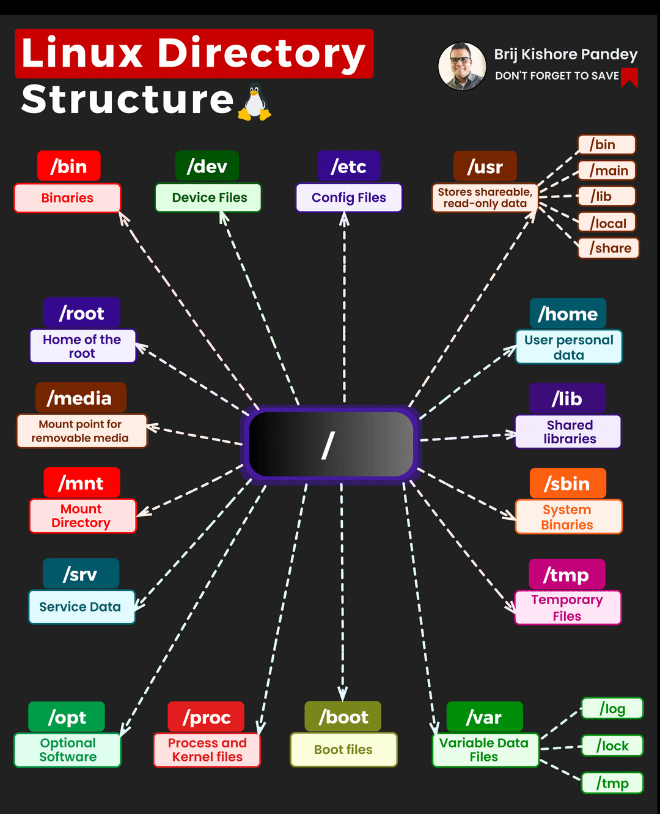

🗃️ /bin: Binaries - This directory holds the essential user command binaries that all users can access.

🔧 /sbin: System Binaries - Contains the essential binaries used by the system administrator for system maintenance and troubleshooting.

⚙️ /etc: System Configuration - Houses the system configuration files, acting as the control panel on Linux.

💽 /dev: Device Files - Home to all device files, such as hard disks, USB, CD-ROM, etc.

📊 /proc: Process Information - A virtual directory detailing system and process information.

📁 /var: Variable Files - This is the variable data directory storing changing data like logs, mails, print spools, etc.

🗑️ /tmp: Temporary Files - This directory stores temporary files created by the system and users.

👥 /usr: User Binaries - Contains multi-user utilities, applications, and libraries.

🏠 /home: User Home Directories - Contains the home directories for users and other accounts.

📚 /lib: System Libraries - Houses library files that are needed by the system and the users.

🎁 /opt: Optional Software - Stores optional or additional software from vendors.

📝 /mnt: Mount Directory - Used for mounting other temporary file systems.

💿 /media: Removable Media - Acts as a temporary mount directory for removable devices.

🔨 /srv: Service Data - This directory contains server-specific services related data.

🚀 /boot: Boot Files - Contains boot loader related files.

👑 /root: Root Home - This is the home directory for the root user.

🔌 /run: Application Information - A tmpfs file system that contains application information.

🧑‍🔬 /usr/local: User Local - Contains user's programs that are installed from the source.

📦 /lib64: 64-bit Libraries - This is where the 64-bit library files are stored.

𝗪𝗵𝘆 𝗶𝘀 𝘁𝗵𝗶𝘀 𝗶𝗺𝗽𝗼𝗿𝘁𝗮𝗻𝘁, 𝘆𝗼𝘂 𝗺𝗶𝗴𝗵𝘁 𝗮𝘀𝗸?🤔

Well, understanding the Linux file system is crucial for many reasons: It helps you locate files swiftly, troubleshoot issues more effectively, and makes you a proficient developer or system administrator.💼👨‍💻

In an era where Linux skills are increasingly in demand, understanding the file system structure isn't just an add-on; it's a necessity.📈🌐
