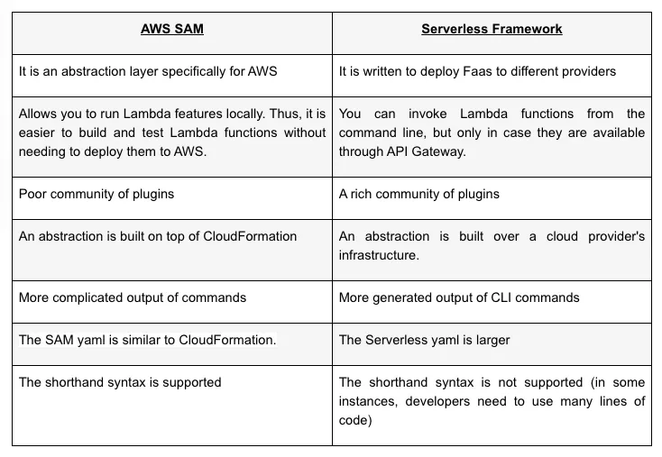

## Serverless Framework vs. AWS SAM: A Brief Definition of Both Approaches
Let’s begin with the basics and define what these tools are and where they are used.

Serverless Framework
Serverless is a framework meant for simplifying the development process. Serverless technology has been around since 2015 and features two definitive camps:

Back-End as a service (or simply BaaS), which is used to build an app that features a backend on the cloud. These are mobile apps that come with complex UI.
Function as a Service or FaaS. In this case, a part of the code is run through event triggers.
Overall, a serverless framework makes it easy to code event-driven functions for various providers, including Google Cloud, AWS, Kubeless, and others. Plus, the framework is usually open-source, and it also receives updates regularly.

AWS SAM
The first name of AWS SAM was Project Flourish; the main goal of this tool is to extend the Amazon WebServices Cloudformation. Simply put, it’s another framework, much like Serverless Framework, that allows programmers to write less code when creating serverless apps. However, SAM is more specific to AWS. Besides, its primary configuration file template.yml is built with CloudFormation.

The main AWS SAM components are as follows:

S3 objects;
CloudWatch events;
API actions;
Amazon SNS notifications;
Amazon Kinesis objects;
DynamoDB tables;
Alexa Events.
Although Serverless Framework and AWS SAM have similar goals and functionalities (both tools guarantee local deployment and work on top of CloudFormation), they have their own merits and demerits. Let’s review AWS SAM and Serverless Framework advantages and disadvantages.

Benefits of AWS SAM
Some software development experts still think that AWS SAM and the Serverless Framework are the same, but there are some differences. The main advantages of AWS SAM are as follows:

Easy to use
You don’t have to spend hours learning how to use it. If you have already worked with CloudFormation, you won’t face any difficulties related to understanding the principles of the SAM syntax.

All Lambda permissions are controlled by AWS
This means that you can use the tool without asking for Lambda permission, which can reduce the CF template size and the technical debt.

Single-deployment configuration
With AWS SAM, one can easily organize related elements and operate on one stack. Plus, this tool can also be used for sharing configuration (timeouts or memory) between various resources. Thus, all related resources can quickly be deployed together as a versioned entity.

Integration with dev tools
Coders use AWS SAM with a set of AWS tools for creating serverless apps. For instance, for debugging or testing the apps built with AWS SAM, programmers can use the AWS CLoud9 IDE. CodeDeploy or CodePipeline are used for building a deployment pipeline.

Extension of AWS CloudFormation
As AWS SAM is an extension of AWS CloudFormation, developers can also use the benefits of AWS CloudFormation deployment capabilities. You can use a set of resources and a myriad of other template options available in AWS CloudFormation.

Drawbacks of SAM
Although the software development market is overloaded with a host of useful tools, you will hardly find a perfect and multi-featured one. SAM vs. Serverless Framework features some drawbacks:

Poor community of plugin creators
When browsing the web with the keyword “AWS SAM vs. Serverless Framework difference,” trying to find the main disadvantages of this tool, the first aspect that might catch your eye is a limited community of plugin creators compared to Serverless Framework.

The API Gateway configuration is based on Swagger
Although there’s no need for end-users to get stuck with the Swagger, it takes more time to build a final product for developers.

This solution is new on the market
And that’s why it still has some bugs. Although end users don’t have to care about this issue, a software development team must spend more time trying to fix all these bugs that might influence the app performance.

What Are the Key Advantages and Disadvantages of Serverless Framework?
Let’s take a deeper look at all the positive and negative aspects of using a Serverless Framework.
Serverless Framework advantages
Fast and easy to deploy
If your main objective is to build an app fast, using a serverless approach might be the right solution. When choosing this method, an app can be deployed in a few days. The thing is that in this case, you don’t have to care about the infrastructure. You mainly need to focus on the code, and that’s all.

The Serverless Framework command lines are easier
When choosing this approach, the deploy command is used for both packages, but with SAM, two absolutely different commands are used.

Improved scalability
If your app is successful on the market, it will be easier to make some changes that might accommodate the growth and future development of your application. When choosing a serverless framework, it will be easier to roll with the punches.

More time for building UX
Remember that your first and foremost task is to build an app that caters to the needs of your targeted audience that actually doesn’t care what infrastructure you use. They can only see the user interface and evaluate the app’s performance. When using a serverless framework, you’ll have more spare time to focus on these issues.

Better flexibility
Remember that to start implementing your future app is easier with serverless compared to traditional methods. And this means you can innovate quickly and move on to your next project.

The generated output
For example, the -v flag (or verbose) outputs absolutely any updates to the stack. When you use SAM, updating a stack demonstrates only the following information: “Waiting for update to complete.” Besides, when you delete a stack, the Serverless CLI usually waits until the stack is removed. With SAM, the default Cloud Formation CLI disappears automatically, and you don’t know if the stack is removed or not.

An extensive community of plugins
One of the greatest benefits of a serverless solution is a rich community of plugins that allow programmers to either modify or extend Serverless Framework configuration.

Drawbacks of Serverless Framework
Poor quality of some plugins
Not all available plugins are of excellent quality. The choice is broad, but not all can be used when needed most of all. However, all available plugins are open-source, and one can improve their quality.

Lack of operational tools
Unfortunately, programmers are contingent on vendors for monitoring and debugging tools. And the process of debugging distributed systems is usually time-consuming and challenging. Plus, it needs access to various metrics to find the root cause.

Architectural complexity
It is clear that there must be a balance between all the features of your future app. It usually takes a lot of time to define how small the feature must be. Moreover, it is difficult to manage all these functions.

Implementation difficulties
The thing is that testing serverless apps is difficult and time-consuming. The units of integration with serverless FaaS are smaller than other architectures, and that’s why QA experts use integration testing more often. There are also some issues related to deployment and packaging.

Comparing AWS SAM with the Serverless Framework
Let’s sum up what has been said in a table:

To wrap up what we’ve covered, we can conclude that both tools are powerful solutions used for building great apps with serverless architecture. We, at TechMagic, use both solutions regularly. After you look at our comparison table “AWS SAM vs. serverless framework,” you’ll understand which tool better fits the needs of your project.

Acorn-i Case
Let’s have a look at one of our projects — Acorn-i, a powerful online platform that empowers the online presence of brands and improves return from e-commerce investments. The main goal of this platform is to provide users with access to Amazon search analytics. As we already know, AWS SAM offers a Lambda-like execution environment that allows you to locally develop, test, and debug apps defined by SAM templates or through the AWS Cloud Development Kit. And we used it for building Acorn-i. Due to this, we managed to build a more reliable and easy-to-use data platform. Moreover, we successfully enhanced the performance of the existing solution 15 times!

If you are still hesitating and don’t know which tool better suits the needs of your project, contact experts from TechMagic. We’ll help you make the right decision.

